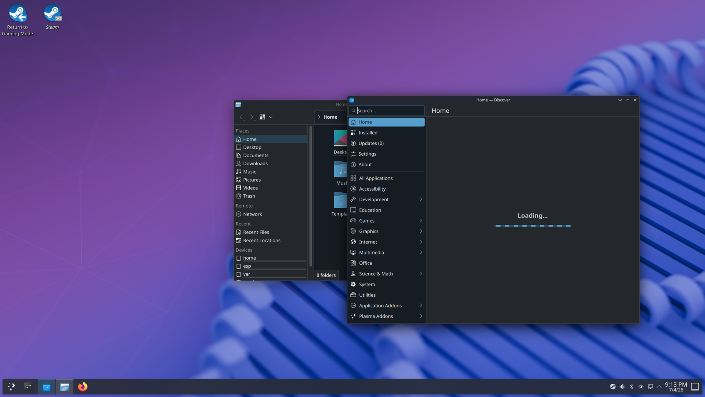
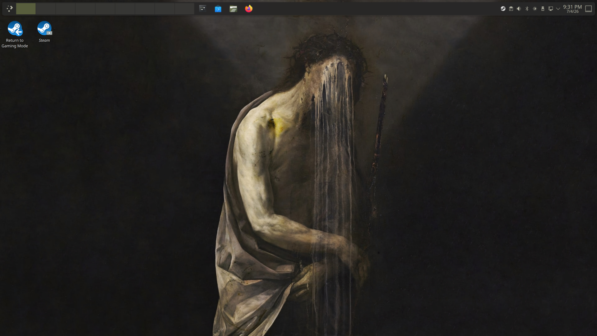
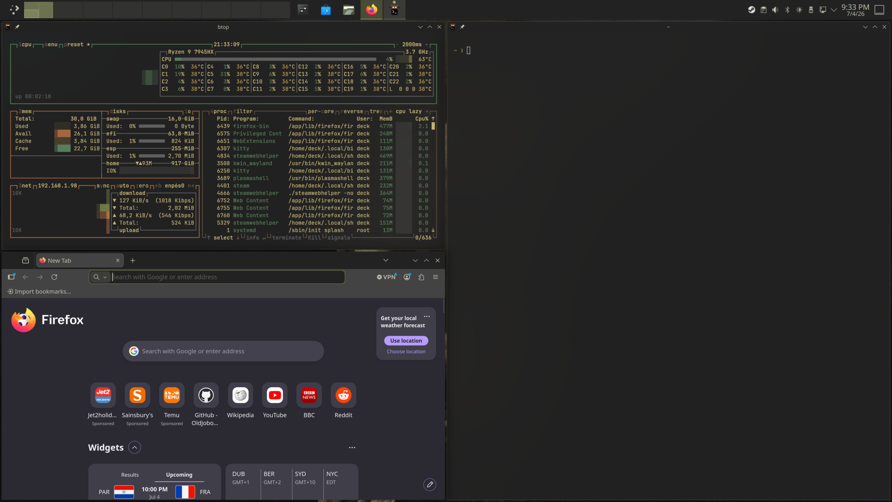
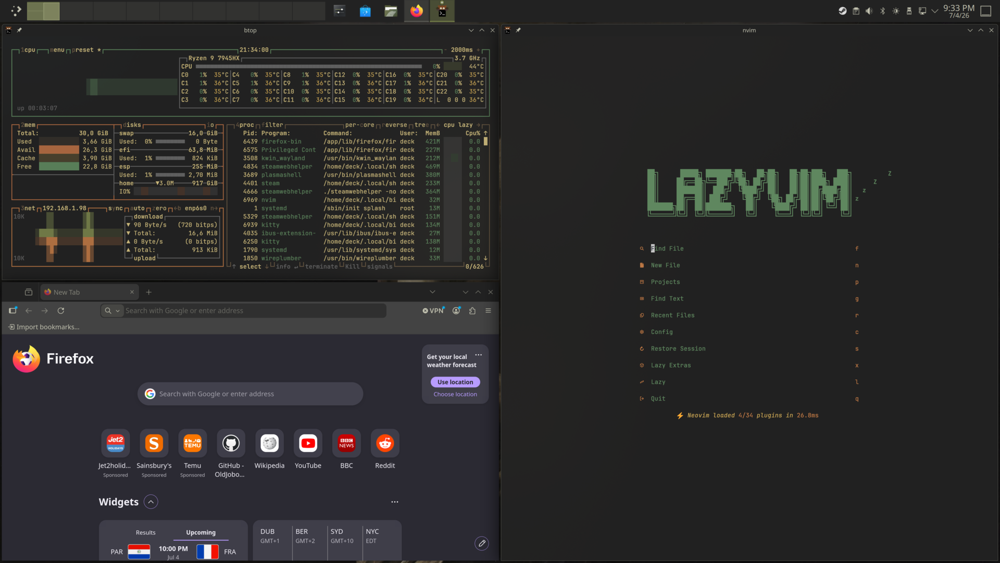

# omasteam

An Omarchy-flavored desktop for the **Steam Deck** (SteamOS + KDE Plasma 6, Wayland) —
reproduced entirely in **userland** (`~/.local`), since SteamOS's root filesystem is
read-only. No `pacman`, no `sudo`, survives OS updates.

Gives you: **kitty** as the default terminal (JetBrainsMono, hidden tab bar, live theme),
**Krohnkite** auto-tiling, the full **Omarchy keybinding** set on KDE, an **omadots**
terminal environment (eza/bat/fzf/zoxide/neovim+LazyVim/starship), and a one-command
**theme switcher** that re-themes the *whole* system from any Omarchy theme's git URL.

> **Unofficial & unaffiliated.** This is an independent hobby project. It is **not**
> affiliated with, endorsed by, or connected to Omarchy, Basecamp, or DHH — it just
> brings an Omarchy-style look/workflow to SteamOS + KDE. Names and themes belong to
> their respective owners. MIT licensed ([LICENSE](LICENSE)); see [NOTICE](NOTICE) for the full disclaimer.

## Screenshots

**Before** — stock SteamOS Desktop Mode (KDE Plasma, default panel + wallpaper):



**After** — omasteam: slim top bar, Omarchy theme + wallpaper, `Return to Gaming Mode` still one click away:



**Krohnkite auto-tiling** — windows tile automatically; here btop, kitty and Firefox share the screen:



**omadots terminal env** — neovim + LazyVim in a kitty pane alongside btop and Firefox:



## Quick start

On the Deck: switch to Desktop Mode, open Konsole, then:

```bash
git clone https://github.com/28allday/omasteam.git ~/omasteam
cd ~/omasteam
./install.sh --with-omadots
# then LOG OUT / reboot
# after the reboot, pick a theme if you like:  theme omarchy tokyo-night
```

**Themes are optional and up to you** — the install doesn't apply one. After the reboot,
pick any Omarchy theme whenever you like:

```bash
theme https://github.com/OldJobobo/omarchy-miasma-theme.git   # paste any omarchy-*-theme URL
```

(You *can* apply one during install with `--theme <git-url>`, but it's not the default.)

Reboot once — that's required, not optional. It activates the login-gated pieces
(`$TERMINAL`, the Run-In-kitty menu, Krohnkite's arrow binds, the 9 virtual desktops, and
the autostart that grabs the launcher shortcuts). After the reboot, everything works.

## Flags

| Flag | Effect |
|------|--------|
| *(none)* | Desktop only: kitty, default-terminal, font, Krohnkite, keybinds |
| `--with-omadots` | + terminal/dev env (eza, bat, fzf, zoxide, neovim/LazyVim, starship, shell) |
| `--omadots-no-nvim` | with `--with-omadots`, skip neovim/LazyVim |
| `--with-bar` | + the **omasteam bar**: an Omarchy-4-style QML top bar (see below) |
| `--theme <git-url>` | install the theme switcher and apply this Omarchy theme |
| `--with-starship` | standalone starship (implied by `--with-omadots`) |
| `--force-kitty` | reinstall kitty even if present |
| `-h`, `--help` | usage |

Idempotent — safe to re-run.

## Requirements

- SteamOS / KDE Plasma 6 **Wayland** session (uses live D-Bus / kglobalaccel)
- Network (downloads kitty, fonts, CLI tools, and the theme repo)
- Stock tools: `curl unzip git kwriteconfig6 qdbus6 kpackagetool6 uuidgen`

## Theming — after install

```bash
theme <git-url>          # install & apply any omarchy-*-theme repo
theme omarchy <name>     # install an OFFICIAL Omarchy theme (tokyo-night, gruvbox,
                         #   nord, catppuccin, kanagawa, everforest, rose-pine, …)
theme <name>             # switch between installed themes
theme                    # list installed
theme wallpaper next     # cycle the current theme's backgrounds (also Meta+Ctrl+Space)
```

The ~20 official themes live *inside* `basecamp/omarchy` (`themes/<name>/`), so
`theme omarchy <name>` sparse-fetches just that subfolder. Community themes are
standalone repos — paste their URL to `theme <git-url>`.

Themes re-color kitty, a generated KDE Plasma color scheme + accent, starship, fzf, btop,
GTK apps, wallpaper, and neovim — all from the theme's `colors.toml`. The **icon theme is
left alone** (system default KDE/Breeze) — themes don't touch it, so no distributor logos
sneak into the app launcher.

## The omasteam bar (`--with-bar`)

An **Omarchy-4-style top bar** — the "quattro" bar — reproduced in pure **QML**,
run by SteamOS's stock **Qt6** as a **wlr-layer-shell** surface. No Quickshell
(Omarchy's compositor-specific shell framework), no compiling, no `sudo`.

```
 ☰  1 2 3 4 5 6 7 8 9        Wed 21:16         steam | 󰤨 󰕾 40% 󰁹 ⏻
 menu + workspaces              clock            Return-to-Gaming + status
```

- **Left:** launcher (`Super+Space`) + KWin virtual desktops (active = accent)
- **Center:** live clock
- **Right:** **Return to Gaming Mode**, network, volume (scroll to change, click to
  mute), battery (auto-hides if none), power
- **Theme-synced:** re-colors from the active omasteam theme's `colors.toml`
- **Interactive:** clicking a workspace switches to it; the power button opens
  the KDE logout prompt

It installs the Plasma panel to the **bottom** (not hidden) so the Deck's real
system tray — and its own Return-to-Gaming button — stay one tap away. The
`Return to Gaming Mode` desktop icon is untouched.

How it works: a small bash daemon (`omasteam-bar-daemon`) polls the system +
theme and writes `~/.local/state/omasteam-bar/state.json`; the bar reads it on a
timer and pushes clicks back through a tiny SQLite outbox (plain QML can't spawn
processes — that's the one thing Quickshell adds that stock Qt lacks).

```bash
omasteam-bar            # start (also autostarts at login)
omasteam-bar stop       # stop bar + daemon
omasteam-bar restart
omasteam-bar status
```

Needs a KDE Plasma 6 **Wayland** session (uses `org.kde.layershell` +
`zwlr_layer_shell_v1`, both stock on SteamOS).

### System menu (`Meta+Alt+Space`)

`--with-bar` also installs the **omasteam system menu** — Omarchy's other
signature piece (`omarchy-menu`), reproduced the same pure-QML way. Press
**`Meta+Alt+Space`** (or click the bar's `☰`) for a centered, keyboard-driven
settings surface that mirrors KDE's **System Settings** sidebar:

```
 Display & Monitor · Accessibility · Connected Devices · Networking ·
 Appearance & Style · Apps & Windows · Sound · Power Management ·
 Input Devices · Workspace · Security & Privacy · Startup & Shutdown ·
 Language & Time · Users · About · Open Full System Settings
 (+ omasteam's own Style / Capture / Power at the bottom)
```

- **Walker-style:** type to filter, `↑`/`↓` to move, `Enter` to open/run,
  `Esc`/`←` to go back, click-outside to dismiss. `Meta+Alt+Space` again toggles it.
- Each settings leaf opens the matching **`kcmshell6`** module (e.g. Display →
  `kcm_kscreen`, Bluetooth → `kcm_bluetooth`); *Open Full System Settings* opens
  the whole app. **Style** = next wallpaper + omasteam theme switcher · **Capture**
  = screenshot region/window/full + record (Spectacle) · **Power** = Lock /
  Suspend / Log Out / Restart / Shut Down / Return to Gaming.
- **Theme-synced** from the same `state.json` the bar uses. Same split: the QML
  overlay pushes the chosen action to a SQLite outbox that the `omasteam-menu`
  launcher drains and runs (a separate `menu_outbox` table, so the bar daemon
  never touches it).

### App launcher (`Meta+Space`)

Apps live in their **own** launcher (Omarchy keeps them separate from the system
menu). Press **`Meta+Space`** (or click the bar's grid icon) for a walker-style,
type-to-filter list of every installed `.desktop` app; `Enter` launches the
highlighted one. Same pure-QML overlay + bash-back split as the system menu (its
own `omasteam-apps` launcher and `apps_outbox` table). `Meta+Space` used to open
KRunner — KRunner moves to **`Alt+Space`**.

## Key bindings (Omarchy-style)

`Super+Return` kitty · `Super+Space` KRunner · `Super+F` files · `Super+B` browser ·
`Super+T` btop · `Super+N` neovim · `Super+W` close · `Super+1..9` workspaces ·
`Super+Shift+1..9` move-to-workspace · `Super+arrows` focus · `Super+Shift+arrows` move ·
`Super+Shift+V` float · `Shift+F11` fullscreen · `Meta+Ctrl+Space` next wallpaper ·
`Meta+Alt+Space` system menu · `Meta+Space` app launcher (both with `--with-bar`;
`Alt+Space` KRunner).

## Layout

```
install.sh        one idempotent entry point (desktop + terminal + theming + bar)
bin/              omasteam-theme, theme (wrapper), omasteam-rebind-shortcuts,
                  omasteam-bar (launcher), omasteam-bar-daemon (bar backend),
                  omasteam-menu (system-menu launcher + dispatcher),
                  omasteam-apps (app-launcher + dispatcher)
artifacts/        static config files copied into place (kitty.conf, service menu, …)
artifacts/bar/    omasteam-bar.qml (the QML bar) + omasteam-menu.qml (system menu)
                  + omasteam-apps.qml (app launcher; autostart / shortcut entries
                  are generated by install.sh with absolute paths)
```

Everything installs into `~/.local` and is safe to re-run. Built for SteamOS's
immutable root — no `pacman`, no `sudo`.
